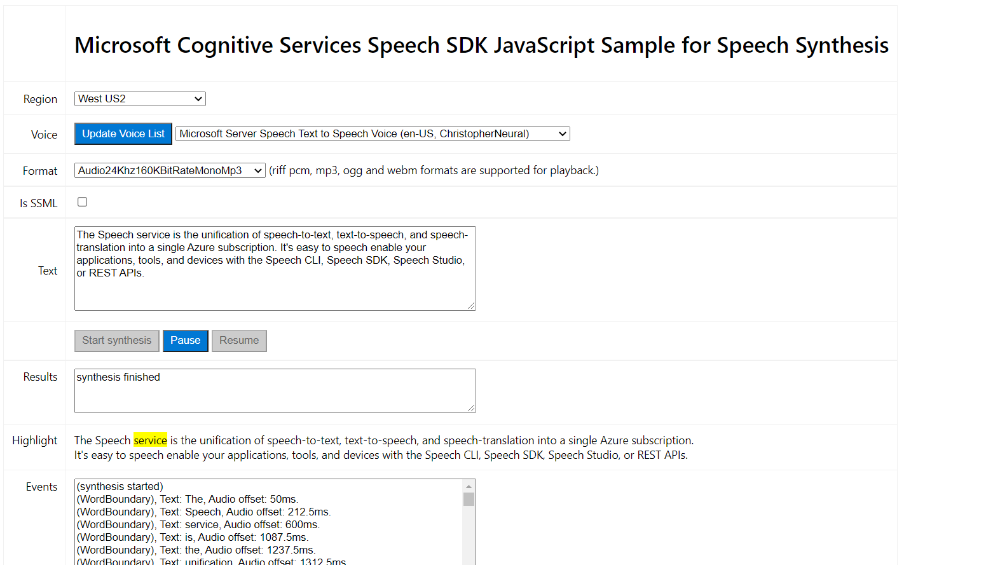

# Sample Repository for the Microsoft Cognitive Services Speech SDK

This project uses Azure Cogntive Services Speech synthesis and Azure Functions to provide 
text-to-speech in the browser. 

This project consists of 2 parts: the HTML file to demonstrate the usage in browser with Javascript, and the NodeJS Azure Function used to authorize the HTML file to use Azure Cognitive Services.

The HTML file works upon the [Azure-Samples repository](https://github.com/Azure-Samples/cognitive-services-speech-sdk), with removed features for legibility and understandability. The full sample, including an Express backend server, can be found here: [cognitive-services-speech-sdk/synthesis.html at master · Azure-Samples/cognitive-services-speech-sdk (github.com)](https://github.com/Azure-Samples/cognitive-services-speech-sdk/blob/master/samples/js/browser/synthesis.html)



## Prerequisites

#### Required

1. [NodeJS](https://nodejs.org/en/)
2. [Azure Function Core Tools](https://docs.microsoft.com/en-us/azure/azure-functions/functions-run-local)

#### Recommended

1. [VSCode](https://code.visualstudio.com/) 
2. [Azure Functions VSCode extension](https://marketplace.visualstudio.com/items?itemName=ms-azuretools.vscode-azurefunctions)

## Get started

1. Get the full path of `/HTML/synthesis.html`, copy that path, & open it in the browser
2. In `/Azure Function/local.settings.json`, add your Speech Region and Speech key under values as such:

    ``` diff
    {
      "IsEncrypted": false,
      "Values": {
        "AzureWebJobsStorage": "",
        "FUNCTIONS_WORKER_RUNTIME": "node",
    +   "speechRegion": "xxxxxx",
    +   "speechKey": "xxxxxxxxxxxxxxxxxxxxxxxxxxxx"
      },
      "host":{
        "CORS": "*"
      }
    }
    ```

3. From your command line, navigate inside the /Azure Function/ folder & run `npm start`. 

    You should see the Azure Functions Core Tools run, and the function should be running at address `http://localhost:7071/api/TTSAuthorizationToken`. If your address is different, you may have to adjust the HTML to make requests to your correct path.

## Resources

- [Microsoft Cognitive Services Speech Service and SDK Documentation](https://aka.ms/csspeech)
