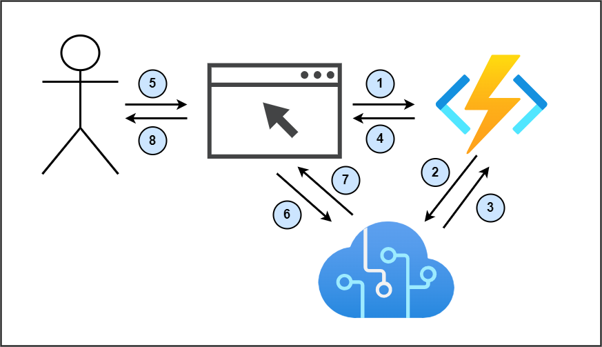

# Sample Repository for the Microsoft Cognitive Services Speech SDK

This project uses Azure Cogntive Services Speech synthesis and Azure Functions to provide 
text-to-speech in the browser. 

This project consists of 2 parts: the HTML file to demonstrate the usage in browser with Javascript, and the NodeJS Azure Function used to authorize the HTML file to use Azure Cognitive Services.

The HTML file works upon the [Azure-Samples repository](https://github.com/Azure-Samples/cognitive-services-speech-sdk), with removed features for legibility and understandability. The full sample, including an Express backend server, can be found here: [cognitive-services-speech-sdk/synthesis.html at master · Azure-Samples/cognitive-services-speech-sdk (github.com)](https://github.com/Azure-Samples/cognitive-services-speech-sdk/blob/master/samples/js/browser/synthesis.html)

## How it works

Azure Cognitive Services can be accessed using a subscription key. However, this is not recommended when calling Cognitive Services from the browser, because this would require making keys publically accessible by end users.

Instead, we can use Azure Functions to create an authorization token that can be used by the browser JavaScript to make calls directly to Cognitive Services. 

When it receives an HTTP request, the Azure Function will call the cognitive service with the subscription keys to retrieve an authorization token. The Azure Function will then respond to the HTTP request by returning the authorization token.



**Steps 1-4 are for setup and are called only once, usually upon page load.**

1. Upon page load, browser requests Authorization token to Azure Function
2. Azure Function creates Authorization token with its Cognitive Services key
3. Cognitive Services returns an Authorization token
4. Azure Function returns the Authorization token

**Steps 5-8 are repeated every time the user presses the play button**

5. User presses play button
6. Browser requests speech from Cognitive services (passes Authorization token and speech options in request as parameters)
7. Cognitive services returns speech
8. Browser plays audio

## Prerequisites

#### Required

1. [NodeJS](https://nodejs.org/en/)
2. [Azure Function Core Tools](https://docs.microsoft.com/en-us/azure/azure-functions/functions-run-local)

#### Recommended

1. [VSCode](https://code.visualstudio.com/) 
2. [Azure Functions VSCode extension](https://marketplace.visualstudio.com/items?itemName=ms-azuretools.vscode-azurefunctions)

## Get started

1. In `/Azure Function/local.settings.json`, add your Speech Region and Speech key under values as such:

    ``` diff
    {
      "IsEncrypted": false,
      "Values": {
        "AzureWebJobsStorage": "",
        "FUNCTIONS_WORKER_RUNTIME": "node",
    +   "speechRegion": "xxxxxx",
    +   "speechKey": "xxxxxxxxxxxxxxxxxxxxxxxxxxxx"
      },
      "host":{
        "CORS": "*"
      }
    }
    ```

2. From your command line, navigate inside the /Azure Function/ folder & run `npm start`. 

    You should see the Azure Functions Core Tools run, and the function should be running at address `http://localhost:7071/api/TTSAuthorizationToken`. If your address is different, you may have to adjust the HTML to make requests to your correct path.

3. Get the full path of `/HTML/synthesis.html`, copy that path, & open it in the browser 

4. Press the `Update Voice List` blue button to get the list of voices available. 

5. Done! You can add text and start synthesis when you are ready! 

#### Common issues

1. If speech is not working, verify that you have added your keys and region to local.settings.json
2. If speech is not working after clicking start synthesis, ensure that the update voice list button was click and that a voice is selected.
3. Ensure that CORS is enabled in local.settings.json to allow requests from a different origin to be accepted by Azure Functions

## Screenshots


## Resources

- [Microsoft Cognitive Services Speech Service and SDK Documentation](https://aka.ms/csspeech)
